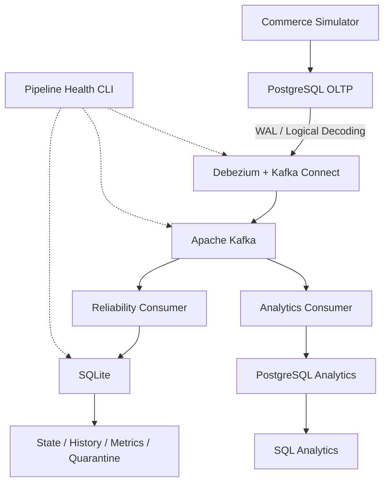

# Mercury — Real-Time Commerce Data Platform

An event-driven data engineering project demonstrating Change Data Capture (CDC), Apache Kafka, reliable event processing, failure recovery, and incremental analytical serving.

Mercury simulates an e-commerce system and streams transactional database changes into independent downstream consumers without repeatedly polling the source database.

## Overview

Traditional batch pipelines periodically extract data from source systems. While effective for many analytical workloads, frequent polling can introduce latency, increase database load, and make it difficult to capture intermediate state changes.

Mercury explores an alternative approach: **Change Data Capture (CDC)**.

Instead of repeatedly querying operational tables, Mercury reads PostgreSQL's Write-Ahead Log (WAL) through Debezium and publishes database changes to Apache Kafka.

Downstream consumers independently process those events to maintain operational state, track pipeline health, and build an analytical read model.

The project focuses on understanding how event-driven data systems behave under normal operation and failure conditions.

## Architecture



### Technology Stack

| Component | Technology | Purpose |
|---|---|---|
| Transactional database | PostgreSQL 17 | OLTP transactions and source of truth |
| Change Data Capture | Debezium 3.2 | Stream PostgreSQL changes through logical decoding |
| Event streaming | Apache Kafka 4.0 | Durable event log and independent consumer groups |
| Application logic | Python | Commerce simulation and event processing |
| Reliability state | SQLite | Current state, event history, metrics, and invalid-event quarantine |
| Analytical serving | PostgreSQL 17 | Queryable analytical read model |
| Infrastructure | Docker Compose | Local service orchestration |

The system uses a single-node Kafka broker and local databases to keep infrastructure costs and operational complexity low.

## Data Flow

### 1. Transactional Source

The Python commerce simulator generates successful purchase transactions using PostgreSQL.

The source database contains six operational tables:

- `customers`
- `products`
- `inventory`
- `orders`
- `order_items`
- `payments`

Each purchase:

1. Creates an order with an initial `CREATED` status.
2. Records the order items.
3. Decreases inventory.
4. Records a successful payment.
5. Updates the order status to `PAID`.
6. Commits the transaction.

These operations are committed as a single PostgreSQL transaction. If an operation fails before commit, the transaction is rolled back.

The simulator also supports inventory replenishment when stock is insufficient.

The current simulator models successful purchases and restocking, rather than a complete payment lifecycle with failed payments, refunds, or cancellations.

### 2. Change Data Capture

PostgreSQL is configured with `wal_level=logical`.

Debezium reads changes through PostgreSQL logical replication and publishes events to Kafka.

The connector captures changes from all six operational tables.

Example Kafka topics:

```text
mercury.public.orders
mercury.public.payments
mercury.public.inventory
mercury.public.customers
mercury.public.products
mercury.public.order_items
```

Events contain Debezium metadata, including source timestamps and operation information.

The connector uses an initial snapshot for existing data and subsequently streams new changes.

### 3. Independent Consumers

Mercury uses two separate Kafka consumer groups.

**Reliability Consumer**

Consumer group: `mercury-order-consumer`

Processes order events and maintains local SQLite state.

Responsibilities include:

- Maintaining the latest known order state.
- Recording processed event history.
- Handling duplicate and out-of-order order events.
- Tracking source-event freshness.
- Quarantining invalid records.

**Analytics Consumer**

Processes order, payment, and inventory events into a separate PostgreSQL database.

Responsibilities include:

- Maintaining current order states.
- Maintaining payment records.
- Maintaining current inventory levels.
- Supporting SQL-based analytical queries.
- Reconstructing analytical state from Kafka history.

Because the consumers use independent consumer groups, they maintain their own Kafka offsets and can recover independently.

## Engineering Challenges

### At-Least-Once Processing and Idempotency

Kafka consumers may encounter the same event more than once.

For example, a consumer can successfully write to its database and crash before committing the corresponding Kafka offset.

After restarting, Kafka may deliver that event again.

The reliability consumer disables automatic Kafka offset commits.

After processing an order event, it persists current state, event history, and source timestamp information before synchronously committing the Kafka offset.

Mercury addresses duplicate delivery through idempotent state updates and an event-history table that identifies events by topic, partition, and offset.

The analytical consumer uses PostgreSQL primary keys and upserts to prevent repeated events from creating duplicate order or payment records.

This provides application-level idempotency for the implemented current-state operations, not exactly-once processing across Kafka and the downstream databases.

### Out-of-Order Events

An older event may arrive after a newer state has already been processed.

Mercury protects current order state by comparing event timestamps.

For example:

```text
18:00 → Order 999: PAID
17:00 → Order 999: CREATED
```

The older `CREATED` event must not overwrite the newer `PAID` state.

Timestamp-guarded updates preserve the latest known state.

The analytical read model uses timestamp-based conflict protection for orders and inventory.

However, this does not guarantee correct ordering across all topics or event types.

### Consumer Crash Recovery

Mercury was tested with a simulated consumer failure after processing an event but before committing its Kafka offset.

When restarted, the consumer received the event again.

Persisted state and idempotent processing logic allowed recovery without duplicating the logical order state.

This demonstrates why event processing and offset management must be designed together.

### Poison Records and Data Quality

Not every event is guaranteed to satisfy the expected data contract.

Mercury was tested with malformed JSON and structurally valid events containing missing required fields.

The reliability consumer records invalid events in a SQLite quarantine table, allowing processing to continue.

The analytical consumer validates required fields and skips invalid events with diagnostic output.

Unexpected database or infrastructure errors are not treated as ordinary invalid records.

### Schema and Serialization Evolution

Mercury includes an optional `shipping_method` field introduced after the original order schema.

The project also encountered a real serialization compatibility issue.

Earlier Debezium events represented PostgreSQL `NUMERIC` values as Kafka Connect Decimal bytes encoded in Base64.

The connector was subsequently configured with:

```json
"decimal.handling.mode": "string"
```

New events represent monetary values as decimal strings.

However, existing Kafka events retain their original serialization.

The analytical consumer therefore supports both representations, using the event schema to decode legacy Decimal values correctly.

Python's `Decimal` type is used for monetary values rather than floating-point arithmetic.

### Connector Outage and Recovery

Mercury was tested by stopping Kafka Connect while the PostgreSQL source continued accepting transactions.

During the outage:

- New transactions were committed in PostgreSQL.
- Kafka did not immediately receive those changes.
- Consumer lag could remain at zero.
- The connector health check reported that Kafka Connect was unreachable.

After restarting Kafka Connect, Debezium resumed and published the missing changes.

This demonstrated an important limitation of Kafka consumer lag:

**Zero consumer lag does not guarantee end-to-end pipeline health.**

Consumer lag only measures progress relative to events already available in Kafka.

## Failure Experiments

The following experiments were performed during development to validate failure handling and recovery behavior.

| Experiment | Observed behavior |
|---|---|
| Consumer crash | An event was redelivered after restarting before offset commit |
| Duplicate processing | Idempotent state updates prevented duplicate logical records |
| Out-of-order order events | An older `CREATED` event did not overwrite a newer `PAID` state |
| Poison record | Invalid events were quarantined by the reliability consumer |
| Connector outage | PostgreSQL continued accepting transactions while Kafka consumer lag could remain zero |
| Connector recovery | Debezium resumed publishing changes after restart |
| Kafka replay | Analytical tables were reconstructed from historical events |
| Decimal serialization change | The analytics consumer decoded both legacy Base64 Decimal values and newer decimal strings |
| Live analytical update | A new order updated the analytical read model without a full rebuild |

## Observability

Mercury includes a command-line health check that combines three signals.

| Signal | Description |
|---|---|
| Connector status | Connector and task states from Kafka Connect REST API |
| Consumer lag | Difference between Kafka log-end offsets and committed order-consumer offsets |
| Freshness | Age of the latest source event processed by the reliability consumer |

Run the health check:

```bash
python -m consumer.pipeline_health
```

Example output:

```text
Mercury Pipeline Health
----------------------------------------
Connector:  RUNNING
Tasks:      RUNNING
Lag:        0 events
Freshness:  4.21 seconds
```

The values above are illustrative.

Freshness represents the age of the most recently processed source event, not a continuously measured end-to-end delivery latency.

It can increase during periods without new source activity, even when the pipeline is functioning correctly.

The health check is a diagnostic CLI tool rather than a continuously running monitoring or alerting service.

## Analytical Serving

Mercury maintains a separate PostgreSQL database for analytical queries.

This separates transactional writes from downstream analytical reads.

The analytical database contains three current-state tables:

- `orders`
- `payments`
- `inventory`

Kafka events are processed incrementally using PostgreSQL upserts.

Analytical aggregates are calculated through SQL queries rather than maintained through event-by-event counter increments.

### Example Queries

**Revenue from successful payments**

```sql
SELECT
    COALESCE(SUM(amount), 0) AS total_revenue
FROM payments
WHERE status = 'SUCCESS';
```

**Orders by status**

```sql
SELECT
    status,
    COUNT(*) AS order_count
FROM orders
GROUP BY status
ORDER BY order_count DESC;
```

**Current inventory**

```sql
SELECT
    product_id,
    stock_quantity
FROM inventory
ORDER BY product_id;
```

### Kafka Replay Test

The analytical tables were truncated and rebuilt by consuming historical Kafka events.

The reconstructed read model contained:

| Metric | Result |
|---|---:|
| Orders | 84 |
| Payments | 84 |
| Revenue | 83,916.00 |
| Inventory products | 1 |

This reconstruction did not require a full-table extraction from the operational PostgreSQL database.

### Live Processing Test

After replay, a new order was generated through the commerce simulator.

The analytics consumer processed the new events and updated the analytical database.

Verified results:

| Metric | Result |
|---|---:|
| Orders | 85 |
| Payments | 85 |
| Revenue | 84,915.00 |
| Current stock | 10 |

The test demonstrated that the read model supports both historical reconstruction and incremental live updates.

## Getting Started

### Prerequisites

- Docker Desktop with Docker Compose
- Python 3
- Git

### 1. Clone the Repository

```bash
git clone https://github.com/Samtoussi/mercury.git
cd mercury
```

### 2. Configure the Environment

Copy `.env.example` to `.env` and replace the placeholder passwords with local development credentials.

On Windows PowerShell:

```powershell
Copy-Item .env.example .env
```

The `.env` file is excluded from version control.

The example configuration uses:

| Service | Address |
|---|---|
| PostgreSQL OLTP | `localhost:5433` |
| PostgreSQL Analytics | `localhost:5434` |
| Kafka | `localhost:9092` |
| Kafka Connect REST API | `localhost:8083` |

### 3. Install Python Dependencies

Create and activate a Python virtual environment.

On Windows PowerShell:

```powershell
python -m venv .venv
.\.venv\Scripts\Activate.ps1
pip install -r requirements.txt
```

### 4. Start Infrastructure

```bash
docker compose up -d
```

This starts PostgreSQL OLTP, PostgreSQL Analytics, Kafka, Kafka Connect, and a one-time Kafka volume-permission initialization service.

Allow the infrastructure to become ready before registering the connector.

### 5. Register the Debezium Connector

```bash
python -m connectors.register
```

The registration script reads the local PostgreSQL credentials and submits the connector configuration to Kafka Connect.

### 6. Start the Consumers

In separate terminals, with the Python environment activated:

**Reliability Consumer**

```bash
python -m consumer.order_consumer
```

**Analytics Consumer**

```bash
python -m analytics.consumer
```

### 7. Start the Commerce Simulator

In another terminal:

```bash
python -m simulator.main
```

The simulator generates commerce activity until stopped.

### 8. Inspect Pipeline Health

```bash
python -m consumer.pipeline_health
```

### 9. Query the Analytics Database

```bash
docker exec -it mercury-analytics psql -U mercury -d mercury_analytics
```

The analytics database contains incrementally maintained order, payment, and inventory records.

### Stopping the Environment

Stop Python processes with `Ctrl+C`.

To stop and remove Docker Compose containers while retaining persistent volumes:

```bash
docker compose down
```

Avoid `docker compose down -v` unless intentionally deleting the local databases and Kafka history.

## Design Decisions and Trade-offs

Mercury deliberately prioritizes understanding event-driven systems over introducing additional infrastructure.

**Why PostgreSQL logical replication?**

It allows database changes to be captured without repeatedly polling entire source tables.

**Why Debezium?**

It provides a mature CDC integration rather than requiring custom WAL decoding, snapshot handling, and replication-offset management.

**Why Kafka?**

It supports durable event retention, replay, and multiple independent consumer groups.

**Why separate analytical storage?**

Kafka is an event log, not a replacement for a query-serving database.

The PostgreSQL analytical read model provides SQL access to current operational information.

**Why not Spark, Flink, Airflow, or Kubernetes?**

The simulated workload does not currently justify distributed stream processing, workflow orchestration, or cluster orchestration.

Python consumers and Docker Compose are sufficient for the project's scope.

## Known Limitations

Mercury is a local learning and portfolio project, not a production-ready commerce platform.

Current limitations include:

- Single-node Kafka without broker-level fault tolerance.
- Locally configured development credentials.
- Manually started Python consumers.
- No automated alerting or monitoring dashboard.
- No distributed transaction spanning Kafka offset commits and analytical database writes.
- Timestamp-based conflict resolution rather than comprehensive cross-topic event ordering.
- The simulator generates successful payments rather than a complete payment lifecycle.
- The reliability consumer does not explicitly commit offsets for events without an `after` payload, including deletes and tombstones.
- SQLite state, history, and metrics are written separately rather than in one atomic transaction.
- The analytical payments table does not implement timestamp-based conflict resolution for out-of-order updates.
- No complete analytical deletion/tombstone handling.
- Analytical poison records are logged and skipped rather than stored in a dedicated persistent dead-letter queue.
- No load testing or demonstrated high-throughput performance guarantees.
- No exactly-once processing guarantee across Kafka and downstream databases.

These limitations are intentional or documented boundaries of V1 rather than claims of production readiness.

## Key Takeaways

Mercury demonstrates practical experience with:

- PostgreSQL transactions and Write-Ahead Logging
- Change Data Capture and logical replication
- Debezium and Kafka Connect
- Kafka topics, offsets, and consumer groups
- At-least-once processing and idempotency
- Out-of-order event handling
- Consumer and connector failure recovery
- Poison records and data quality
- Schema and serialization evolution
- Pipeline observability
- Replayable analytical state
- Incremental analytical serving

The central lesson is that **moving events is only one part of building a reliable data pipeline**.

Correctness also depends on how systems handle state, retries, failures, ordering, and recovery.

---

**Mercury — Built to explore the engineering challenges behind real-time data systems.**